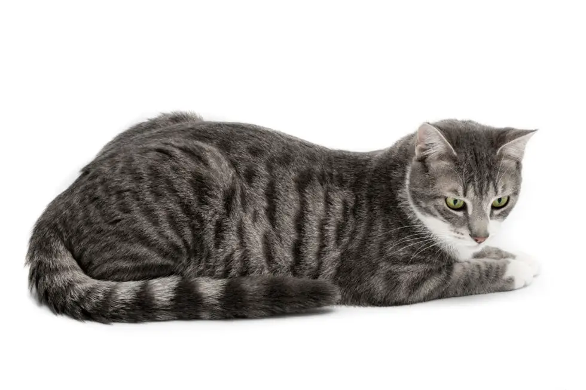

# katten-website
een website voor katten

Titel en opmaak
html
Kopiëren
Bewerken
<head> ... </head>
Zet de titel van de pagina.

Linkt naar een stijlblad (style.css) voor kleuren en opmaak.

Hoofdtitel van de site
html
Kopiëren
Bewerken
<header>
  <h1>Enzo's Katten Winkel</h1>
</header>
Laat bovenaan de pagina een grote titel zien.

Menu (navigatie)
html
Kopiëren
Bewerken
<nav>
  <a href="index.html">Home</a>
  <a href="sub1.html">Menukaart</a>
  <a href="sub2.html">Kattenrassen</a>
  <a href="sub3.html">Contact</a>
</nav>
Hiermee kun je klikken naar andere pagina’s.

Welkomsttekst + afbeelding
html
Kopiëren
Bewerken

Hallo, ik ben Enzo...

Tekst die uitlegt wat de site doet.

Een plaatje van een kat.

Informatie in 3 vakken
html
Kopiëren
Bewerken
<main>
  
Populaire katten

  
Openings tijden

  
Contact info

</main>
Een lijst met kattenrassen.

De dagen dat de winkel open is.

Manieren om contact op te nemen.

Extra sluiting
html
Kopiëren
Bewerken
<section>
  <h3>Extra Sluitingsdag(en)</h3>
  
Geen zin

</section>
Grappig bedoeld: de winkel is gesloten tot het jaar 3000.

Onderaan de pagina
html
Kopiëren
Bewerken
<footer>
  
&copy; 2025 Enzo's Katten Winkel

</footer>
Laat copyright zien.

# sub1

Begin van de pagina
html
Kopiëren
Bewerken
<html lang="nl">
De website is in het Nederlands.

Informatie over de pagina (in <head>)
html
Kopiëren
Bewerken
<head>
  <title>Enzo's katten winkel</title>
  <link rel="stylesheet" href="style.css">
  <meta ...>
</head>
Titel van de pagina (bovenin je browser).

Stijlblad voor kleuren/opmaak.

Extra info over de site (auteur, zoekwoorden, omschrijving).

Bovenaan de pagina
html
Kopiëren
Bewerken
<header>
  <h1>Menukaart</h1>
</header>
Laat groot zien: "Menukaart".

Menu om te klikken
html
Kopiëren
Bewerken
<nav>
  <a href="index.html">Home</a>
  <a href="sub1.html"><b><u>Menukaart</u></b></a>
  <a href="sub2.html">Kattenrassen</a>
  <a href="sub3.html">Contact</a>
</nav>
Navigatieknoppen naar andere pagina’s.

Menukaart is vetgedrukt en onderstreept (actieve pagina).

De zichtbare inhoud
html
Kopiëren
Bewerken
<body>
  

    <h2>Binnenkort beschikbaar</h2>
    
Deze pagina is verwacht af te zijn in het jaar 3000

  

</body>
Laat zien dat de menukaartpagina nog niet af is.

Gekke opmerking: pas klaar in het jaar 3000.

# sub2

Pagina-info bovenaan
html
Kopiëren
Bewerken
<html lang="nl">
<head>
  <meta charset="UTF-8">
  <meta name="viewport" content="width=device-width, initial-scale=1.0">
  <title>Enzo's Katten Winkel</title>
  <link rel="stylesheet" href="style.css">
</head>
De pagina is in het Nederlands.

Titel: Enzo's Katten Winkel (dit zie je in het tabblad).

Laadt een stijlblad voor de opmaak (style.css).

De kop van de pagina
html
Kopiëren
Bewerken
<header>
  <h1>Kattenrassen</h1>
</header>
Grote titel bovenaan: Kattenrassen.

Navigatie (menu)
html
Kopiëren
Bewerken
<nav>
  <a href="index.html">Home</a>
  <a href="sub1.html">Menukaart</a>
  <a href="sub2.html"><b><u>Kattenrassen</u></b></a>
  <a href="sub3.html">Contact</a>
</nav>
Klikmenu naar andere pagina’s.

“Kattenrassen” is vet en onderstreept (actieve pagina).

Hoofdinhoud van de pagina
html
Kopiëren
Bewerken
<main>
  

    <h2>Onze Populaire Kattenrassen</h2>
    <ul> ... </ul>
    
Wil je een ras die hier niet staat? Laat het ons weten!

  

</main>
Titel: Onze Populaire Kattenrassen

Lijst van kattenrassen met korte uitleg:

Europese korthaar

Maine Coon

Brits korthaar

Siberische kat

Chinese naaktkat

Tekst onderaan: “Ken je een ander ras? Laat het weten!”

Voettekst (onderaan)
html
Kopiëren
Bewerken
<footer>
  
&copy; 2025 Enzo's Katten Winkel

</footer>
Tekst met jaartal en naam van de winkel.

Pagina-instellingen
html
Kopiëren
Bewerken
<html lang="nl">
<head>
  <meta charset="UTF-8">
  <meta name="viewport" content="width=device-width, initial-scale=1.0">
  <title>Enzo's Katten Winkel</title>
  <link rel="stylesheet" href="style.css">
</head>
De website is in het Nederlands.

Titel: Enzo's Katten Winkel (staat in je browser-tab).

Laadt een stijlbestand (CSS) voor kleuren en opmaak.

Titel bovenaan de pagina
html
Kopiëren
Bewerken
<header>
  <h1>Contact</h1>
</header>
Grote titel: Contact

Menu (navigatiebalk)
html
Kopiëren
Bewerken
<nav>
  <a href="index.html">Home</a>
  <a href="sub1.html">Menukaart</a>
  <a href="sub2.html">Kattenrassen</a>
  <a href="sub3.html"><b><u>Contact</u></b></a>
</nav>
Menu met links naar andere pagina's.

Contact is vet en onderstreept → je zit nu op die pagina.

Inhoud van de pagina
html
Kopiëren
Bewerken
<main>
  

    <h2>Stuur ons een bericht!</h2>
    
Heb je vragen of suggesties? Neem contact met ons op via een van de onderstaande manieren.

    <ul>
      <li><a href="https://www.instagram.com/">Instagram</a></li>
      <li><a href="https://nl-nl.facebook.com/">Facebook</a></li>
      <li><a href="https://mail.google.com/">Email</a></li>
      <li>Telefoon: 06-12345678</li>
    </ul>
  

</main>
Titel: Stuur ons een bericht!

Korte uitleg over contact opnemen.

Lijstje met:

Link naar Instagram

Link naar Facebook

Link naar E-mail

Telefoonnummer

Onderkant (footer)
html
Kopiëren
Bewerken
<footer>
  
&copy; 2025 Enzo's Katten Winkel

</footer>
Copyright

Jaar: 2025

Naam van de winkel
